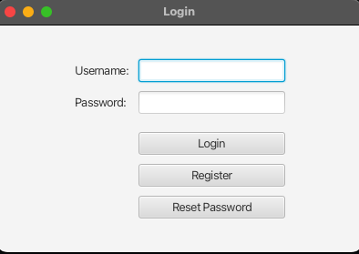
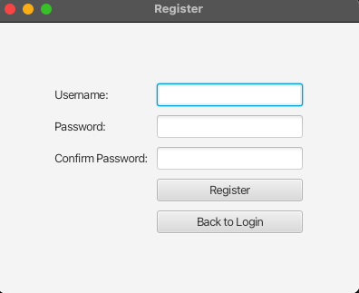
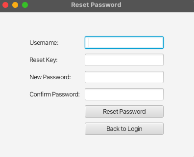
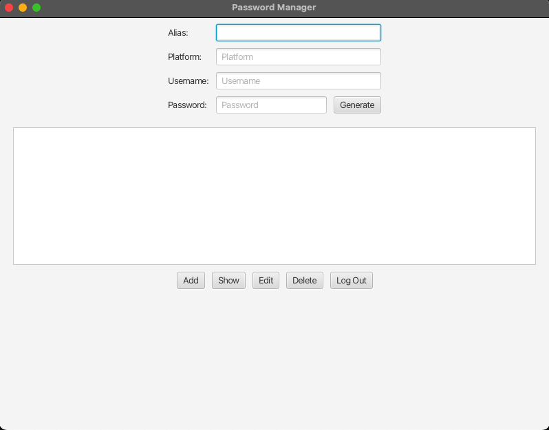

# PassVault

PassVault is a secure password management application that allows users to store, retrieve, and manage their passwords securely. This application uses AES encryption for securing the stored passwords and SHA-256 for hashing user passwords.

## Features

- User Registration and Login
- Password Encryption and Decryption
- Password Hashing with Salt
- Password Vault for storing and managing multiple passwords
- Reset Password functionality

## Prerequisites

- JDK 8 or above
- JavaFX SDK

## Setup Instructions

1. **Clone the repository:**

    ```bash
    git clone https://github.com/daxtangco/PassVault.git
    cd PassVault
    ```

2. **Open the project in your IDE:**

    Open the project in IntelliJ IDEA or any other IDE that supports Java and JavaFX.

3. **Run the Application:**

    Locate the `Main.java` file and run it. This will start the application.

4. **Download for MacOS:**

    You can download the MacOS version of the application here: [PassVault-1.0.dmg](https://drive.google.com/file/d/1_J0-D6r94CNXw06zPbKoLJIn8BcQlDW8/view?usp=sharing)

## Project Structure

src
└── main
└── java
├── Database.java
├── EncryptionService.java
├── LoginUI.java
├── Main.java
├── PassVaultUI.java
├── PasswordEntry.java
├── PasswordGenerator.java
├── PasswordVault.java
├── RegisterUI.java
├── ResetPasswordUI.java
├── User.java
└── UserDatabase.java
resources


## Screenshots

### Login Screen


### Register Screen


### Reset Password Screen


### Password Vault Screen


## Usage

### Register a New User
- Open the application.
- Click on the "Register" button.
- Fill in the required details and click "Register".
- Copy the reset key provided in the alert.

### Login
- Open the application.
- Enter your username and password.
- Click "Login".

### Reset Password
- Open the application.
- Click on "Reset Password".
- Enter your username, reset key, and new password.
- Click "Reset Password".

### Manage Passwords in Vault
- Once logged in, you can add, edit, delete, and view your passwords securely.

## License

This project is licensed under the MIT License. See the [LICENSE](LICENSE) file for details.

## Contributing

Feel free to submit issues or pull requests. For major changes, please open an issue first to discuss what you would like to change.

## Acknowledgements

- [JavaFX](https://openjfx.io/)
- [SQLite](https://www.sqlite.org/index.html)
